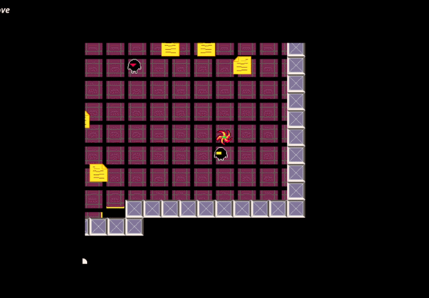

# jeng - An evolving game + engine hybrid project

jeng is an iterative game+engine hybrid project written in jai.
The core idea is to build a prototype and lean game engine with minimal dependencies and files.

Each iteration focuses on creating a new prototype.
Fully copying the engine source code is intended, making it easier to iterate quickly for the current prototype.


# Game - RECURSE


## Compile and Run 
```run.bat```

# Game/Engine Features
- nested rendering
- nested worlds
- world as a pickup
- level editor
- level serializer
- command line terminal
- plugin support
- sprites
- sfx / music


## How to Play
Science your way out.

| Action | Key |
|----------|----------|
| Move   | WASD/Arrows   |
| Enter Warp   | Q   |
| Pickup   | E   |
| Mute   | F2   |
| Edit/Play   | F5   |
| Exit   | ESC   |
| Terminal   | `   |

## Terminal Commands
Open terminal.

```help```

